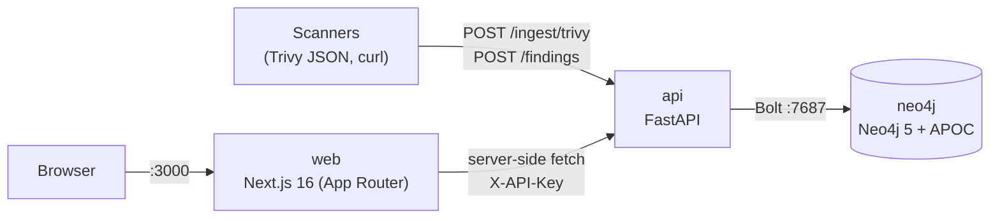

# ASPM

Application Security Posture Management: connects **vulnerable code** to the **production assets it exposes**, stores it as a graph, and ranks every finding by real-world risk.

> Which internet-facing production assets are exposed by which vulnerable code, and where did that vulnerability come from?

## Architecture



| Service | Tech | Port | Role |
|---|---|---|---|
| `neo4j` | Neo4j 5.24 community + APOC | 7474 (browser), 7687 (bolt) | Stores the attack-path graph; uniqueness constraints on every node key |
| `api` | Python 3.12, FastAPI, neo4j driver | 8000 | Ingest, query, risk scoring, API-key auth |
| `web` | Next.js 16, React 19, Tailwind v4, shadcn/ui, react-force-graph-2d | 3000 | Server-rendered UI; all data fetching happens on the Next.js server |

### Data model

```
(:Repository {name, url, language})
    -[:CONTAINS]->
(:Vulnerability {id, cve, severity, description, status})
    -[:AFFECTS]->
(:Asset {name, environment, type, internet_facing})
```

- Keys (`Repository.name`, `Vulnerability.id`, `Asset.name`) are unique-constrained and normalized on ingest (whitespace collapsed; repo/asset names lower-cased, vulnerability ids upper-cased), so re-ingesting merges instead of duplicating.
- A *finding* is one `Repository → Vulnerability → Asset` chain.

### Request flow

1. A scanner report or a manual finding is `POST`ed to the API with an `X-API-Key` header.
2. The API validates and normalizes it, then `MERGE`s it into Neo4j.
3. A browser request hits the Next.js server, which calls the API server-side (the API key never reaches the browser) and renders the page.

### Risk scoring

Each finding gets a 0–100 score and a P1–P4 priority, computed in the API per vulnerability → asset pair:

**score = severity × environment × exposure**, normalized so CRITICAL + production + internet-facing = 100.

| Factor | Weights |
|---|---|
| Severity | CRITICAL 10 · HIGH 7 · MEDIUM 4 · LOW 1 |
| Environment | production 1.0 · staging/uat/qa 0.6 · development/test 0.3 · unknown 0.6 |
| Exposure | internet-facing 1.5 · internal 1.0 |

Priority: **P1** ≥ 70 · **P2** ≥ 40 · **P3** ≥ 20 · **P4** < 20.

## Quick start (Docker, whole stack)

Requires Docker Desktop.

```bash
cp .env.example .env
```

Set `ASPM_API_KEY` in `.env` to a random value (e.g. `python -c "import secrets;print(secrets.token_urlsafe(32))"`), then:

```bash
docker compose up -d --build
```

| URL | What |
|---|---|
| http://localhost:3000 | Web UI |
| http://localhost:8000/docs | API docs (Swagger); click **Authorize** and paste the key |
| http://localhost:7474 | Neo4j browser (`neo4j` / `aspm_dev_password`) |

Startup order is enforced by health checks: `neo4j` → `api` → `web`. On first start the API creates the constraints; the graph starts empty. To load sample data, see [`demo/README.md`](demo/README.md) (`docker compose --profile demo up -d`).

Stop with `docker compose down` (add `-v` to also delete the graph data).

### Configuration (`.env`)

| Variable | Default | Used by |
|---|---|---|
| `ASPM_API_KEY` | *(required)* | `api` (validates), `web` (sends) |
| `NEO4J_PASSWORD` | `aspm_dev_password` | `neo4j` (only applied when the data volume is first created), `api` |
| `API_PORT` | `8000` | Host port for `api` |
| `WEB_PORT` | `3000` | Host port for `web` |

## Local development (without containers for api/web)

```bash
docker compose up -d neo4j

cd backend
python -m venv venv && venv\Scripts\activate
pip install -r requirements.txt
cp .env.example .env
uvicorn main:app --reload --port 8000

cd frontend
npm install
npm run dev
```

`frontend/.env.local` needs:

```
NEXT_PUBLIC_API_URL=http://localhost:8000
ASPM_API_KEY=<same value as backend/.env>
```

The API refuses to start without `ASPM_API_KEY`, and the web pages get a 401 if the two values differ.

## Getting data in

Ingest a single finding:

```bash
curl -X POST http://localhost:8000/findings \
  -H "X-API-Key: <key>" -H "Content-Type: application/json" \
  -d '{"repository":{"name":"payments-service","url":"https://github.com/example-org/payments-service"},
       "vulnerability":{"id":"VULN-1001","cve":"CVE-2024-12345","severity":"CRITICAL","description":"SQL injection"},
       "asset":{"name":"prod-payments-api","environment":"production","type":"Kubernetes Service","internet_facing":true}}'
```

Ingest a Trivy report:

```bash
trivy fs --scanners vuln --format json . > trivy.json
curl -X POST "http://localhost:8000/ingest/trivy?repo_name=my-repo&repo_url=https://github.com/org/my-repo&asset_name=prod-api&asset_environment=production&asset_type=Container&asset_internet_facing=true" \
  -H "X-API-Key: <key>" -H "Content-Type: application/json" --data-binary @trivy.json
```

Each Trivy post is one scan run. New findings start `open`; findings the run no longer reports (same repo and scanner) become `resolved`; a `resolved` finding that comes back is reopened. Statuses set by people (`in_progress`, `accepted_risk`, `false_positive`) are kept. Add `&commit=<sha>` to record the commit, and `&partial=true` for scans of part of a repo so nothing is auto-resolved. The response is `{scan_id, ingested, resolved, reopened, skipped, ids}`.

## API

All routes except `/health` require `X-API-Key`.

| Method | Path | Description |
|---|---|---|
| `GET` | `/health` | Liveness |
| `POST` | `/findings` | Ingest one repository → vulnerability → asset chain (`scanner = manual`) |
| `GET` | `/findings` | Findings with risk, sorted by risk; `?status=` (default `open,in_progress`, `all` for everything); includes findings with no asset |
| `GET` | `/findings/{id}` | One vulnerability with its repositories, assets and per-asset risk |
| `PATCH` | `/findings/{id}` | Set status: `open`, `in_progress`, `resolved`, `accepted_risk`, `false_positive` |
| `GET` | `/assets` | Assets with open / in-progress vulnerability counts per severity and worst risk |
| `GET` | `/graph` | Graph as `{nodes, links}`; `?status=` like `/findings` |
| `GET` | `/scans` | Scan runs, newest first; `?repo=`, `?limit=` |
| `POST` | `/ingest/trivy` | Ingest a Trivy JSON report as one scan run with auto-resolve; `?commit=`, `?partial=` |

## UI

| Page | What it shows |
|---|---|
| `/` | Findings table ranked by risk, severity summary tiles, status filter, first / last seen |
| `/graph` | Interactive force-directed graph of the whole attack-path graph |
| `/findings/[id]` | Finding detail: description, risk, NVD link, status change, repo → vuln → asset path |
| `/assets` | Asset inventory ranked by risk |
| `/scans` | Scan history with ingested / resolved / reopened counts |

## Project layout

```
docker-compose.yml     neo4j + api + web (+ demo-seed under the demo profile)
.env.example           compose configuration
demo/                  opt-in sample data: seed.cypher, purge.cypher, trivy-sample.json
backend/
  main.py              FastAPI app: models, auth, routes, risk scoring, Trivy connector
  Dockerfile
frontend/
  app/                 pages (App Router, Server Components)
  components/          UI components (graph, nav, badges, shadcn/ui)
  lib/                 shared types, graph helpers, API headers
  Dockerfile           standalone Next.js build
```

## Current limitations

- Single shared API key; the web UI has no user login.
- Only Trivy is supported as a scanner connector, and reports are pushed manually.
- No tests or CI yet.
- Risk weights are hardcoded; no exploitability (EPSS/KEV) or asset-criticality input.
- Local-dev defaults (Neo4j password, plaintext `.env`) are not production-ready.
